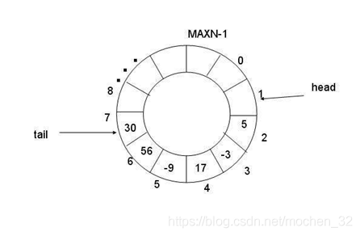

## 环形数组队列

以前串口接收数据都是事先定义一个缓存数组，每次接收中断产生时一个字节一个字节地接收，数据接收完后再来解析。

一开始是类似这样的：

```
void USART1_IRQHandler(void)                	
{
	u8 Res;

	if(USART_GetITStatus(USART1, USART_IT_RXNE) != RESET) 
	{
		Res = USART_ReceiveData(USART1);//(USART1->DR);	
		
		USART_RX_BUF[Fluke_Data.point++] = Res;

		....
		一些其他操作比如字符串查找，内存复制。。
		if(strstr((const char*)USART_RX_BUF, "C") != NULL)		
		{				
            memset(Fluke_Data.Fluke_Data_Buffer, 0, Fluke_Data_REC_LEN);      
            memcpy(Fluke_Data.Fluke_Data_Buffer, USART_RX_BUF, Fluke_Data.point); 	
            Fluke_Data.point = 0;
            memset(USART_RX_BUF, 0, USART_REC_LEN);      
            Fluke_Data.isUsefull	= true;		
        }    
     } 
 }
```

后来发现有些程序能正常接收，有些程序最后一个数据收不到，最后发现是中断优先级配置的很高，CPU响应太快，导致有时候串口中断还没执行完又来了新数据造成丢数据。

然后改成这样：

```
void USART1_IRQHandler(void)                	
{
	u8 Res;
   
	if(USART_GetITStatus(USART1, USART_IT_RXNE) != RESET) 
	{
		Res = USART_ReceiveData(USART1);	

		USART_RX_BUF[Fluke_Data.point++] = Res;

		if(Res == '\n')									   
		{ 
			Fluke_Data.ok = 1;
		}	
		
		if(Fluke_Data.point >= USART_REC_LEN)
		{
			Fluke_Data.point = 0;
			memset(USART_RX_BUF, 0, USART_REC_LEN);      
		}		
	}
}

void usart_parse(void)
{
	if(Fluke_Data.ok == 1)
	{
		Fluke_Data.ok = 0;
		USART_Cmd(USART1, DISABLE);  
		
		........
		
		Fluke_Data.point = 0;
		memset(USART_RX_BUF, 0, USART_REC_LEN);     
		
		USART_Cmd(USART1, ENABLE);  
	}
}
```

对于长度不固定，格式也不固定的数据，这个程序并不能直接用，对于长时间连续接收很多数据的情况实现效率也比较低，内存占用也比较大。

后来接触到环形数组，处理起这些情况都比较好，适用性更强。

环形数组是一个类似于圆环的数组。一般采用数组进行数据存储，数组的首尾相连组成一个环，读数据的起始地址和写数据的起始地址都映射到该环的某一个的位置，只要指明一个正方向，采用先进先出机制，每次直接往队尾存入数据，直到数组的尾部，然后再回到数组的首部，读数据也类似的变化，直接从队头开始读到队尾，队头与队尾之间的数据，就是最新的缓存数据。



定义环形数组结构体

```
typedef struct ringbuff
{
    uint16_t tail;
    uint16_t head;
    const uint16_t lenght;
    uint8_t * const buff_addr;
}RINGBUFF_STRUCT;

typedef RINGBUFF_STRUCT RINGBUFF;

#define RINGBUFF_DEF(name, size) \
        static uint8_t name##_ringbuff[size];       /* 缓冲内存 */\
        static RINGBUFF_STRUCT name =               /* 结构体初始化 */\
        {                                           \    
            .tail = 0,                              \
            .head = 0,                              \
            .lenght = size,                         \
            .buff_addr = name##_ringbuff            \
        };  
```

获取环形数组内部已缓存的数据大小

```
static inline uint16_t Ringbuff_GetLenght(RINGBUFF *ring)
{
    uint16_t head = ring->head;
    uint16_t tail = ring->tail;
    return (head <= tail) ? (tail - head) : (ring->lenght - head + tail);
}
```

将数据放入缓存内存，往队尾插入数据

```
uint8_t Ringbuff_PutByte(RINGBUFF *ring, uint8_t byte)
{
    if((Ringbuff_GetLenght(ring) + 1) == ring->lenght) return RINGBUFF_FAIL;

    ring->buff_addr[ring->tail++] = byte;

    if(ring->tail == ring->lenght) ring->tail = 0;

    return RINGBUFF_SUCCESS;
}
```

从队头开始取出到队尾的缓存数据

```
uint16_t Ringbuff_Push(RINGBUFF *ring, uint8_t buff[], uint16_t size)
{
    uint16_t lenght = Ringbuff_GetLenght(ring);

    if(size < lenght) lenght = size;

    if(ring->head < ring->tail){

        memcpy(buff, ring->buff_addr + ring->head, lenght);
    }else{

        uint16_t pos = ring->lenght - ring->head;

        memcpy(buff, ring->buff_addr + ring->head, pos);
        memcpy(buff + pos, ring->buff_addr, lenght - pos);
    }

    ring->head = (ring->head + lenght) % ring->lenght;
    return lenght;
}
```

取出某段缓存

```
uint8_t Ringbuff_PushBte(RINGBUFF *ring, uint8_t *byte)
{
    if(Ringbuff_GetLenght(ring) == 0) return RINGBUFF_FAIL; 

    *byte = ring->buff_addr[ring->head++];

    if(ring->head == ring->lenght) ring->head = 0;
    
    return RINGBUFF_SUCCESS;
}
```

清某段缓存

```
void Ringbuff_Clear(RINGBUFF *ring, uint16_t lenght)
{
    uint16_t size = Ringbuff_GetLenght(ring);

    if(size > lenght) size = lenght;

    ring->head = (ring->head + size) % ring->lenght;
}
```

清全部缓存

```
void Ringbuff_ClearAll(RINGBUFF *ring)
{
    ring->head = 0;
    ring->tail = 0;
}
```

读指定位置数据

```
uint8_t Ringbuff_ReadByte(RINGBUFF *ring, uint16_t pos)
{
    uint16_t des = (ring->head + pos) % ring->lenght;

    return ring->buff_addr[des];
}
```

